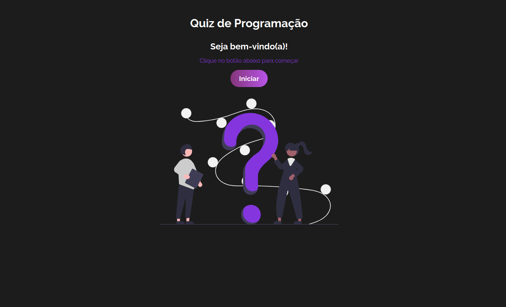
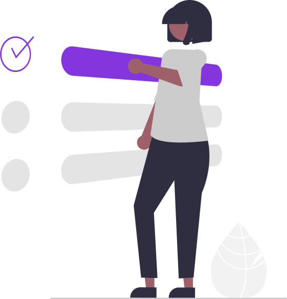
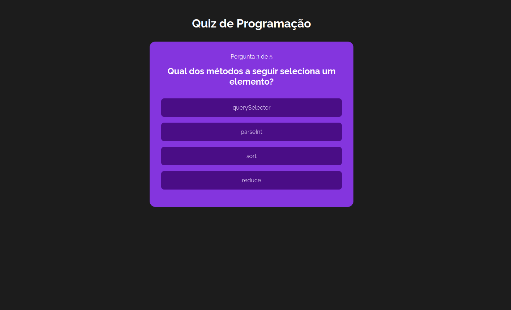
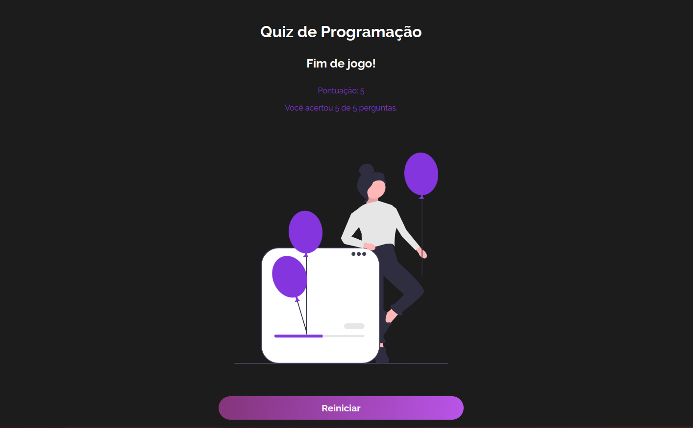

# Quiz de Programação

Neste projeto, foi criado um site simples com algumas perguntas sobre programação onde o usuário pode escolher uma opção. Ao escolher, se estiver errada, a resposta certa será mostrada; se estiver certa, é somado um ponto e segue para a próxima pergunta, até o final das 5 perguntas. No fim do jogo, é mostrada a pontuação e quantidade de acertos.

### Tecnologias utilizadas
- React.js
- JavaScript
- CSS

### Como rodar este projeto
É necessário ter o [Node.js](https://nodejs.org/en) instalado na sua máquina.
1. Faça clone deste repositório:
```bash
git clone https://github.com/carolcampos22/quiz.git

```
2. Entre na pasta do projeto e instale as dependências:

```bash
cd quiz-react
npm install

```
3. Para visualizar o site no navegador:
```bash
npm run start

```
Em seguida, clique no link que aparecerá no terminal (http://localhost:5173/)


### Layout

1. Início


2. Esolha de categoria


3. Question



4. Fim do jogo


### Próximos passos

- Mostrar dicas
- Criar um banco de dados de perguntas e uma API Rest 

### Autora

#### Carolina Mendes - Web developer
[](https://www.linkedin.com/in/dev-carolina-mendes/)
